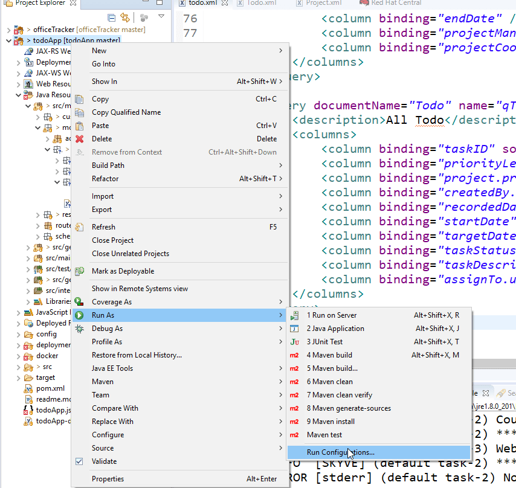

# Todo Application Tutorial
Let's learn by example.

Throughout this tutorial, we will walk you through create an advance Todo Application by using Awesome Enterprise Application Framework - [Skyve](https://skyve.org/) .

This Todo Application will have we to assign and manage tasks need to be done for our project. We also try to put some effort to create some great Report by using Jaspersoft BI tools which embedded to Skyve Framework.

In this project, we will try to cover as much as possible Skyve Development Process and concepts.

***This tutorial guide assumes familiarity with Web technology and architecture, Java EE concepts, the Java language and the use of common development tools like Eclipse.***

## Getting started
Before continue with our Tutorial, there are some page you may want to visit

* [What is skyve?](https://skyve.org/what-is-skyve) - Will help you to get answer for the question What [Skyve](https://skyve.org) is, and how it will usefull on your Enterprise Application Development?

* [Getting Started](https://skyve.org/getting-started) - will help you to have some idea on how to start with our [Skyve](https://skyve.org) framework.

* [Dev Guide](https://skyvers.github.io/skyve-dev-guide/) - will help you to learn and understand about our development. It also cover almost [Skyve framework](https://skyve.org) elements and concepts. There are quite a lot of real example for you to refer too.

* [Join Us On Slack](https://join.slack.com/t/skyveframework/shared_invite/enQtNDMwNTcyNzE0NzI2LWNjMTBlMTMzNTA4YzBlMzFhYzE0ZmRhOWIzMWViODY4ZTE1N2QzYWM1MTdlMTliNDIyYTBkOWZhZDAxOGQyYjQ) - If you get stuck, feel free to ask us some questions on the Skyve Slack team.

Now, move on to the next stage to learn "How to create Application with [Skyve Framework](https://skyve.org)
## Create TodoApp project
To create new [Skyve](https://skyve.org) Project, you can go to [Getting Started](https://skyve.org/getting-started) page, and then scroll down to **Skyve For Developer**  section, click to **Create** button.

***We recommend you watch the video first***

Or you can go directly to [Create Skyve Project Page](https://foundry.skyve.org/foundry/project.xhtml).

On Skyve creation page, key in below informations:
* ***Email adress***: The valid email address will be using to receive download link from [Skyve](https://skyve.org)
* ***Project Name***: Your project name
* ***Customer Name***: Your customer name
* ***Database Dialect***: Select your Database Engine
* ***Skyve Script***: This field is optinal - we will back to Skyve Script later in this course


Finally, Click to the **Create Project** button.

Now, go to check your email inbox to find Project Download Link. Download Project and extract it to your Work Space.
## Import TodoApp Project
Now we will import the project to Eclipse Editor.

Right Click on the Project Explorer window, and choose **Import** menu and sub-menu item like below:


Select Import Existing Maven Project from import wizard window. Like below


Then click **Next** button.

Next step is browse your root project folder([Skyve Project](https://skyve.org) which you extracted before).


Then click to **Finish** button.

Wait for Eclipse Import Wizard finish the importing process and re-index your project.
Then we can go to next page to install [WildFly](https://wildfly.org/) Server to run our Application.
## Install and Configure WildFly Server
To run our **TodoApp** we will need to install and configure for [WildFly](https://wildfly.org) Server.
Skyve work well on WildFly version 13+ (we tested and run well on **WildFly 16** - count to date of Tutorial)
### Install WildFly Server
*You can skip this step if WildFly server is already installed on your system.*

Before install WildFly Server, make sure **JBoss Tools** installed on your system.
To check if it installed properly, go to Eclipse Marketplace.


Searching with JBoss keyword


After **JBoss Tools** was installed properly, follow these steps to install WildFly Server.
1. Open Server Window

2. Click to the link ***No Servers are available. Click this link to create a new server...*** in Server Window.
3. **New Server** windows will open, looking for **WildFly 16** then click Next button.

4. Click to the Next button.

5. Click to the Download and install runtime... link.

6. Select WildFly 16, then click to Next button

7. Accept the terms of license agreement and click Next button.

8. Click to Finish button to finish the installation.


9. Wait Eclipse to Download and Install process finish before move to next step.


### Configure Wildfly datasource to support MySQL

It is easier to start Skyve Application with H2 Database, it does not require any extra of configurations. However in this tutorial I want to place you on the real world of Enterprise Application Development by using MySQL Database.

You can check if MySQL installed on your system, if not you can go to [MySQL Download](https://dev.mysql.com/downloads/mysql/) choose right version for your system, and install MySQL on your system.

You may also need a SQL Client to working with your data, [MySQL Workbench](https://www.mysql.com/products/workbench/) is perfect for it, however you may use any tools which you familiar with.

Once MySQL is ready on your system, let configure WildFly datasource to support MySQL Engine.

1. Download MySQL JDBC Driver
Visit [MySQL Connector JDBC page](https://dev.mysql.com/downloads/connector/j/)

At this moment - when we introduce this Tutorial. JDBC 8 connector is not supported yet. So we will go with the previous General Available version.


Select Platform Independent for Operating System


Download suitable version for your operating system. I am using Windows Operating System, so I go to download **Platform Independent (Architecture Independent), ZIP Archive**

2. Deploy MySQl JDBC Driver.
Navigate to the directory ***$WILDFLYHOME/modules/system/layers/base/com***
***($WILDFLYHOME - Is the Root Folder, which you selected when you install WildFly Server - For example: D:\JavaPrograms\EclipseWorkSpace\wildfly-16.0.0.Final)***

3. Create mysql/main directory
4. Navigate to main directory and copy MySQL JDBC driver's jar there


5. Create a module.xml file with the content below:
```xml
<?xml version="1.0" encoding="UTF-8"?>

<module xmlns="urn:jboss:module:1.1" name="com.mysql">
    <resources>
        <resource-root path="mysql-connector-java-[VERSION]-bin.jar"/>
    </resources>
    <dependencies>
        <module name="javax.api"/>
        <module name="javax.transaction.api"/>
        <module name="javax.servlet.api" optional="true"/>
    </dependencies>
</module>
```
Replace [VERSION] by your JDBC Connector Version.

6. Navigate to the directory  ***$WILDFLYHOME/standalone/configuration***, open the ***standalone.xml*** file. Looking for datasources.
```xml
<subsystem xmlns="urn:jboss:domain:datasources:5.0">
    <datasources>
        <datasource jndi-name="java:jboss/datasources/ExampleDS" pool-name="ExampleDS" enabled="true" use-java-context="true" statistics-enabled="${wildfly.datasources.statistics-enabled:${wildfly.statistics-enabled:false}}">
            <connection-url>jdbc:h2:mem:test;DB_CLOSE_DELAY=-1;DB_CLOSE_ON_EXIT=FALSE</connection-url>
            <driver>h2</driver>
            <security>
                <user-name>sa</user-name>
                <password>sa</password>
            </security>
        </datasource>
        <drivers>
            <driver name="h2" module="com.h2database.h2">
                <xa-datasource-class>org.h2.jdbcx.JdbcDataSource</xa-datasource-class>
            </driver>
        </drivers>
    </datasources>
</subsystem>
```

And define mysql driver here.

```xml
<subsystem xmlns="urn:jboss:domain:datasources:5.0">
    <datasources>
        <datasource jndi-name="java:jboss/datasources/ExampleDS" pool-name="ExampleDS" enabled="true" use-java-context="true" statistics-enabled="${wildfly.datasources.statistics-enabled:${wildfly.statistics-enabled:false}}">
            <connection-url>jdbc:h2:mem:test;DB_CLOSE_DELAY=-1;DB_CLOSE_ON_EXIT=FALSE</connection-url>
            <driver>h2</driver>
            <security>
                <user-name>sa</user-name>
                <password>sa</password>
            </security>
        </datasource>
        <drivers>
            <driver name="h2" module="com.h2database.h2">
                <xa-datasource-class>org.h2.jdbcx.JdbcDataSource</xa-datasource-class>
            </driver>
			<driver name="mysql" module="com.mysql"/>
        </drivers>
    </datasources>
</subsystem>
```


So far we have done for initial configuration step.
Next, we will go to deploy our TodoApp to WildFly Server, configure Database for TodoApp and try to run it as first time.

## Deploy and Configure Skyve Project
### Deploy Skyve Project
Its very easy to deploy [Skyve](https://skyve.org) to WildFly Server.
1. Open WildFly deployments folder.
Right click on the Server and click to Show In -> File Browser.

2. Expand TodoApp Project, you will see deployments folder.

3. Copy todoApp.json and todoApp-ds.xml to WildFly deployments folder.

4. Add TodoApp project to Wildfly Server.

Right click to the WildFly 16 at localhost then click Add and Remove... menu.


Select todoApp from Available part -> Click Add button -> Click Finish button.


### Configure Skyve Project
We will need to do some configuration to run our project.

#### Configure todoApp.json
Change the content settings

Open your Eclipse Workspace folder and create content folder.


Open todoApp.json and looking for Content settings.
```json
// Content settings
	content: {
		// directory path (note that if you are running on Windows do not use backslashes)
		directory: "${SKYVE_CONTENT:/C:/_/skyve/skyve-ee/content/}",
		// CRON Expression for CMS Garbage Collection job - run at 7 past the hour every hour
		gcCron: "0 7 0/1 1/1 * ? *",
		// Attachments stored on file system or inline
		fileStorage: true
	},
```

Change value for directory to your content folder. It will become something like below:
```json
// Content settings
	content: {
		// directory path (note that if you are running on Windows do not use backslashes)
		directory: "${SKYVE_CONTENT:/D:/JavaPrograms/EclipseWorkSpace/content/}",
		// CRON Expression for CMS Garbage Collection job - run at 7 past the hour every hour
		gcCron: "0 7 0/1 1/1 * ? *",
		// Attachments stored on file system or inline
		fileStorage: true
	},
```

Next, we will need to change the Environment Settings.
By default, [Skyve](https://skyve.org) was setting as production mode. So we will need to change to development mode.
```json
// Environment settings
	environment: {
		// test, sit, uat, dev etc: null = prod
		identifier: "${IDENTIFIER:null}",
		// Dev Mode does not cache the view metadata allowing the effects of view changes to be observed without redeploying
		devMode: true,
		// Customer Default
		customer: "ezmasy",
		// Run the jobs scheduled in the data store or not - set false for slave skyve instances
		jobScheduler: true,
		// Password hashing algorithm - usually bcrypt, pbkdf2, scrypt. MD5 and SHA1 are unsalted and obsolete.
        passwordHashingAlgorithm: "bcrypt",
        // Absolute path on the filesystem to the source directory where modules live for creating new documents
        // via skyve script, e.g. c:/workspace/project/src/main/java
        moduleDirectory: null,
        // email address for system support
        supportEmailAddress: "rucvan.pr@gmail.com"
	},
```
We will need to change identifier to dev.

One more concept we need to take note. In the todoApp.json defined a ***bootstrap user settings***, later we will use this user information to login to our todoApp.
```json
// bootstrap user settings - creates a user with all customer roles assigned, if the user does not already exist
	bootstrap: {
		customer: "ezmasy",
		user: "${BOOTSTRAP_USERNAME:setup}",
		email: "rucvan.pr@gmail.com",
		password: "${BOOTSTRAP_PASSWORD:setup}"
	}
```

We have done the basic and needed configuration to make sure our project can run.

Now we will moving on MySQL Data Source configuration.

#### Configure todoApp-ds.xml
```json
<?xml version="1.0" encoding="UTF-8"?>
<datasources>
	<datasource jndi-name="java:/todoAppDB" pool-name="todoApp" enabled="true" jta="true" use-ccm="false">
		<connection-url>jdbc:mysql://todoApp_db:3306/todoApp?useCursorFetch=true&amp;defaultFetchSize=100</connection-url>
		<driver>mysql</driver>
		<pool>
			<min-pool-size>5</min-pool-size>
			<max-pool-size>10</max-pool-size>
		</pool>
		<security>
			<user-name>sa</user-name>
			<password>sa</password>
		</security>
	</datasource>
</datasources>
```

For example: my database is todoApp and was deploy on my local computer at port 3306.

Then I will need to change the connection-url like below:
```xml
<?xml version="1.0" encoding="UTF-8"?>
<datasources>
	<datasource jndi-name="java:/todoAppDB" pool-name="todoApp" enabled="true" jta="true" use-ccm="false">
		<connection-url>jdbc:mysql://localhost:3306/todoApp?useCursorFetch=true&amp;defaultFetchSize=100</connection-url>
		<driver>mysql</driver>
		<pool>
			<min-pool-size>5</min-pool-size>
			<max-pool-size>10</max-pool-size>
		</pool>
		<security>
			<user-name>sa</user-name>
			<password>sa</password>
		</security>
	</datasource>
</datasources>
```

Another change need to be done is the security, you will need provide valid authentication to connect to your database.

For security reason, we strongly recommend you to create account for each application, so it was not affected to other application if one of the application connection was revealed. It is good practice to use strong password for your application. If it is hard for you to think for a strong password, you can use this web application to generate very strong password https://passwordsgenerator.net/
```xml
<?xml version="1.0" encoding="UTF-8"?>
<datasources>
	<datasource jndi-name="java:/todoAppDB" pool-name="todoApp" enabled="true" jta="true" use-ccm="false">
		<connection-url>jdbc:mysql://localhost:3306/todoApp?useCursorFetch=true&amp;defaultFetchSize=100</connection-url>
		<driver>mysql</driver>
		<pool>
			<min-pool-size>5</min-pool-size>
			<max-pool-size>10</max-pool-size>
		</pool>
		<security>
			<user-name>todouser</user-name>
			<password>Ggq"MBb,q5\KEzx*</password>
		</security>
	</datasource>
</datasources>
```
## Run TodoApp

Before run project, we will need to generate domain class first.

1. Right click to the todoApp on Projects Explorer and choose Run As -> Run Configurations...


2. Looking for Maven Build > todoApp Generate Domain then click Run


* Wait for few seconds(maybe take more time to run first time), Once the process done you will see the result on Console Windows like below;
* 
   
3. On Servers Windows, right click to the server and choose Start.


4. When you see below info on Consoles Window, mean todoApp was deployed and run properly on your localhost.


If not, you may try to check and debug by yourself or [Join Us On Slack](https://join.slack.com/t/skyveframework/shared_invite/enQtNDMwNTcyNzE0NzI2LWNjMTBlMTMzNTA4YzBlMzFhYzE0ZmRhOWIzMWViODY4ZTE1N2QzYWM1MTdlMTliNDIyYTBkOWZhZDAxOGQyYjQ) and question there. You will get supported from [Skyve](https://skyve.org) team or any community team member.

5. Access TodoApp from Web Browser at [http://localhost:8080/todoApp](http://localhost:8080/todoApp)


6. You can login with your Bootstrap user info, by default:

User Name: setup

Password: setup

7. After you login successfully, you will see something like this.


By default, Skyve goes with Admin module, the Admin module with quite a lot of useful functions which are ready for you to try and evaluate [Skyve Framework](https://skyve.org).

The user guide is available at https://skyvers.github.io/skyve-user-guide/. The user guide is for end users of Skyve applications and describes how to navigate around the user interface and make use of the built in functions that ship with Skyve.

## Build TodoApp Module
Module concept and module components was defined at https://skyvers.github.io/skyve-dev-guide/modules/
so in this tutorial We will not repeat it again.

### Create `todo.xml` file
Inside the `todo` package, create an xml file named `todo.xml`

`todoxml` file will have below components:
#### Module header
```xml
<?xml version="1.0" encoding="UTF-8" standalone="yes"?>
<module name="todo" title="Todo Module" xmlns="http://www.skyve.org/xml/module" xsi:schemaLocation="http://www.skyve.org/xml/module ../../schemas/module.xsd"
	xmlns:xsi="http://www.w3.org/2001/XMLSchema-instance">
	<homeRef>edit</homeRef>
	<homeDocument>Todo</homeDocument>
</module>
```
*In this example, the home (or default) target for the module is the edit view of the Todo document.*

#### Documents
Skyve uses the term document to indicate the business-focused nature of application objects.

In this tutorial we suppose that will have below documents - objects involved. 
1. Staffs - who will create the tasks, assign tasks and also doing tasks.
2. Projects - each project may contain multiple tasks base on customer requirements.
3. Todo - task need to be done for each project

So let go to define above documents inside our `todo.xml`

```xml
<?xml version="1.0" encoding="UTF-8" standalone="yes"?>
<module name="todo" title="Todo Module" xmlns="http://www.skyve.org/xml/module" xsi:schemaLocation="http://www.skyve.org/xml/module ../../schemas/module.xsd"
	xmlns:xsi="http://www.w3.org/2001/XMLSchema-instance">
	<homeRef>edit</homeRef>
	<homeDocument>Todo</homeDocument>
	
	<documents>
		<document ref="Project" />
		<document ref="Todo" />
		<document ref="Staff" />
		
		<document ref="User" moduleRef="admin" />
		<document ref="Contact" moduleRef="admin" />
	</documents>
</module>
```
In this example, we defined document `User`, and `Contact` as referent from `admin` module because each user in our application will associate with one staff.

#### Roles
Each role specifies the privilege levels for documents the role will access (and associated actions). The role name is the name displayed when assigning roles to user security groups in the admin.

For each document, the privilege level is specified in terms of C (Create) R (Read) U (Update) D (Delete) and the document scope access level, either G, C, D or U. The underscore character (_) means no permission is granted.

In our `Todo App`, we will define below roles:
1. Staff Manager - who are able to manage Staffs
2. Project Manager - to grand to Project Manager who are able to create projects, tasks
3. Project Member - to grand to Project Team Memeber who are not able to create project, tasks but will work with tasks to finish projects.
```xml
<?xml version="1.0" encoding="UTF-8" standalone="yes"?>
<module name="todo" title="Todo Module" xmlns="http://www.skyve.org/xml/module" xsi:schemaLocation="http://www.skyve.org/xml/module ../../schemas/module.xsd"
	xmlns:xsi="http://www.w3.org/2001/XMLSchema-instance">
	<homeRef>edit</homeRef>
	<homeDocument>Todo</homeDocument>
	
	<documents>
		<document ref="Project" />
		<document ref="Todo" />
		<document ref="Staff" />
		
		<document ref="User" moduleRef="admin" />
		<document ref="Contact" moduleRef="admin" />
	</documents>
	
	<roles>
		<role name="StaffManager">
			<description>Staff Manager - who are able to manage Staffs</description>
			<privileges>
				<document permission="CRUDC" name="Staff" />
			</privileges>
		</role>
		<role name="ProjectManager">
			<description>Project Manager - who are able to manage projects and create tasks for projects.</description>
			<privileges>
				<document permission="CRUDC" name="Project" />
				<document permission="CRUDC" name="Todo" />
			</privileges>
		</role>
		<role name="ProjectMember">
			<description>Project Member - who are not able to create project, tasks but will work with tasks to finish projects.</description>
			<privileges>
				<document permission="_RU_C" name="Project" />
				<document permission="_RU_C" name="Todo" />
			</privileges>
		</role>
	</roles>
</module>
```
#### Menus
The application menu is declared in terms of groups and items. A menu group is an expandable menu (submenu).
```xml
<?xml version="1.0" encoding="UTF-8" standalone="yes"?>
<module name="todo" title="Todo Module" xmlns="http://www.skyve.org/xml/module" xsi:schemaLocation="http://www.skyve.org/xml/module ../../schemas/module.xsd"
	xmlns:xsi="http://www.w3.org/2001/XMLSchema-instance">
	<homeRef>edit</homeRef>
	<homeDocument>Todo</homeDocument>
	
	<documents>
		<document ref="Project" />
		<document ref="Todo" />
		<document ref="Staff" />
		
		<document ref="User" moduleRef="admin" />
		<document ref="Contact" moduleRef="admin" />
	</documents>
	
	<roles>
		<role name="StaffManager">
			<description>Staff Manager - who are able to manage Staffs</description>
			<privileges>
				<document permission="CRUDC" name="Staff" />
			</privileges>
		</role>
		<role name="ProjectManager">
			<description>Project Manager - who are able to manage projects and create tasks for projects.</description>
			<privileges>
				<document permission="CRUDC" name="Project" />
				<document permission="CRUDC" name="Todo" />
			</privileges>
		</role>
		<role name="ProjectMember">
			<description>Project Member - who are not able to create project, tasks but will work with tasks to finish projects.</description>
			<privileges>
				<document permission="_RU_C" name="Project" />
				<document permission="_RU_C" name="Todo" />
			</privileges>
		</role>
	</roles>
	
	<menu>
		<list document="Staff" name="Staff">
			<role name="StaffManager" />
		</list>
		<list document="Project" name="Project">
			<role name="ProjectManager" />
			<role name="ProjectMember" />
		</list>
		<list document="Todo" name="To Do">
			<role name="ProjectManager" />
			<role name="ProjectMember" />
		</list>
	</menu>
</module>
```


### Define Documents
Skyve uses the term document to indicate the business-focused nature of application objects. You can find more detail about Skyve Documents by follow this link https://skyvers.github.io/skyve-dev-guide/documents/

Within the application file structure, each document is assigned a package. For example package `Staff` will be assign to `Staff` document, `Project` package will be assign to `Project` document... etc.

The document package includes declarations of actions, reports, views and the associated Bizlet file. The Bizlet file contains document-specific behaviours including overrides of default action behaviours and document bean lifecycle events (e.g. newInstance, preSave, etc.).

In this tutorial we will define three Documents Staff, Project and Todo(task).
#### Staff Document
In side our `Todo` module, create a new `Staff` package.


Inside the document package, the `document.xml` file defines aspects of a document, including(bold items are compulsory):
* **document metadata (name, description, aliases),**
* **bizKey (business key),**
* **attributes (fields & references),**
* conditions,
* constraints, and
* documentation (doc).

So, to define `Staff` document we will need to create `Staff.xml` file under `Staff` document package with definition of `document metadata`, `bizkey`, and `attributes`
##### Document meta data
```xml
<?xml version="1.0" encoding="UTF-8" standalone="yes"?>
<document name="Staff"
				xmlns="http://www.skyve.org/xml/document"
				xsi:schemaLocation="http://www.skyve.org/xml/document ../../../schemas/document.xsd"
				xmlns:xsi="http://www.w3.org/2001/XMLSchema-instance">
	<persistent name="Todo_Staff" />
	<singularAlias>Staff</singularAlias>
	<pluralAlias>Staffs</pluralAlias>
	<iconStyleClass>fa fa-users</iconStyleClass>
```
- `name` : document name.
- `persistent` : name of document's database table.
- `singularAlias`: Singular Alias
- `pluralAlias`: Plural Alias
- `iconStyleClass`: document icon on the menu. [Skyve](https://skyve.org) use `fontawesome` as icons resource. You can looking for any icon by this link https://fontawesome.com/icons. Please take note about `fontawesome` version to find correct icons.

In some case, may you need to define your own custom icons. [Skyve](https://skyve.org) support 16 and 32 pixel icons and you can refer `admin` -> `contact` document.

##### bizKey
To enable the application to display references simply, each document must define a business key (bizKey) definition (similar to a Java toString() method for the document). The bizKey is the default representation of the entire document instance.

bizKey was defined like below:
```xml
<document name="Staff"
				xmlns="http://www.skyve.org/xml/document"
				xsi:schemaLocation="http://www.skyve.org/xml/document ../../../schemas/document.xsd"
				xmlns:xsi="http://www.w3.org/2001/XMLSchema-instance">
	<persistent name="Todo_Staff" />
	<singularAlias>Staff</singularAlias>
	<pluralAlias>Staffs</pluralAlias>
	<iconStyleClass>fa fa-users</iconStyleClass>
	<bizKey expression="{user.contact.name}"/>
```
##### attributes
Each document normally has multiple attributes, they can be different data type, and how it gendered in the view also can different in some way. Please refer to this link https://skyvers.github.io/skyve-dev-guide/documents/#attributes to understand about attribute type.

In this Tutorial, for `Staff` document we will have the attributes like below:

| Attribute name | Data Type - length | Description                   |
|----------------|--------------------|-------------------------------|
| user           | User               | Associate User                |
| socialTitle    | Enum               | Social titles                 |
| dateOfBirth    | Date               | Date Of Birth                 |
| idCardNo       | String - 20        | ID Card Number                |
| issuedDate     | Date               | ID Card issued date           |
| expiredDate    | Date               | ID Card expired date          |
| bio            | Text               | Brief description about staff |
| dept           | String - 50        | Departure                     |
| bu             | String - 50        | Business Unit                 |
| jobTitle       | String - 100       | Job Title                     |
| startDate      | Date               | Started Date                  |


To define above attributes, follow this definition:
```xml
<attributes>
	<association name="user" type="composition" required="true">
		<displayName>User</displayName>
		<documentName>User</documentName>
	</association>
	
	<enum name="socialTitle">
		<displayName>Social Title</displayName>
		<defaultValue>mr</defaultValue>
		<values>
			<value code="mr" name="mr" description="Mr" />
			<value code="ms" name="ms" description="Ms" />
			<value code="mrs" name="mrs" description="Mrs" />
			<value code="dr" name="dr" description ="Dr"/>
		</values>
	</enum>
	<!-- Contact Info will be loaded from Contact Document -->
	
	<date name="dateOfBirth" required="true">
		<displayName>Date Of Birth</displayName>
	</date>
	
	<text name="idCardNo" required="true">
		<displayName>ID Card Number</displayName>
		<length>20</length>
	</text>
	
	<date name="issuedDate">
		<displayName>Issued Date</displayName>
	</date>
	
	<date name="expiredDate">
		<displayName>Expired Date</displayName>
	</date>
	
	<memo name="bio">
		<displayName>BIO</displayName>
		<description>Brief BIO info</description>
	</memo>
	
	<text name="dept">
		<displayName>Department</displayName>
		<length>50</length>
	</text>
	
	<text name="bu">
		<displayName>Business Unit</displayName>
		<length>50</length>
	</text>
	
	<text name="jobTitle">
		<displayName>Job Title</displayName>
		<length>100</length>
	</text>
	
	<date name="startDate">
		<displayName>Start Date</displayName>
	</date>	
	
</attributes>
```
#### Project document
After you done with Staff document, you will be familiar with document definition. So create `Project document` should be easy game for you.

Please go ahead and create Project document with below attributes:

| Attribute name     | Data Type - length | Description         |
|--------------------|--------------------|---------------------|
| projectCode        | String - 50        | Project Code        |
| projectName        | String - 100       | Project Name        |
| projectDescription | Text               | Project Description |
| projectOwner       | Association - Contact            | Project Owner       |
| startDate          | Date               | Start Date          |
| endDate            | Date               | End Date            |
| projectManager     | Association - Staff              | Project Manager     |
| projectCoordinator | Association - Staff              | Project Coordinator |

```xml
<?xml version="1.0" encoding="UTF-8" standalone="yes"?>
<document name="Project"
				xmlns="http://www.skyve.org/xml/document"
				xsi:schemaLocation="http://www.skyve.org/xml/document ../../../schemas/document.xsd"
				xmlns:xsi="http://www.w3.org/2001/XMLSchema-instance">
	<persistent name="Todo_Project" />
	<singularAlias>Project</singularAlias>
	<pluralAlias>Projects</pluralAlias>
	<iconStyleClass>fa fa-briefcase</iconStyleClass>
	<bizKey expression="{projectCode} - {projectName}"/>
	<attributes>
		<text name="projectCode" required="true">
			<displayName>Project Code</displayName>
			<length>50</length>
		</text>
		<text name="projectName" required="true">
			<displayName>Project Name</displayName>
			<length>100</length>
		</text>
		<memo name="projectDescription">
			<displayName>Project Description</displayName>
			<description>Project Description</description>
		</memo>
		<association type="composition" name="projectOwner" required="true">
			<displayName>Project Owner</displayName>
			<documentName>Contact</documentName>
		</association>
		<date name="startDate" required="true">
			<displayName>Start Date</displayName>
		</date>
		<date name="endDate" required="true">
			<displayName>End Date</displayName>
		</date>
		<association type="composition" name="projectManager" required="true">
			<displayName>Project Manager</displayName>
			<documentName>Staff</documentName>
		</association>
		<association type="composition" name="projectCoordinator" required="true">
			<displayName>Project Coordinator</displayName>
			<documentName>Staff</documentName>
		</association>		
	</attributes>
	
</document>
```
#### Todo Document
Next, we will go to create `Todo` document. This document will present for task in project which staff have to do.

In this tutorial, `Todo` document will have following attributes:

| Attribute name   | Data Type - length | Description                        |
|------------------|--------------------|------------------------------------|
| taskID           | String - 20        | Task ID Number                     |
| priorityLevel    | Enum               | Priority Level of the task         |
| project          | Association - Project            | Project which task is belong       |
| createdBy        | Association - Staff              | Staff, who create the task         |
| recordedDateTime | DateTime           | When task was recoreded            |
| startDate        | DateTime           | When task was started              |
| targetDate       | DateTime           | When task was expected to complete |
| actualStartDate  | DateTime           | Actual Start Date                  |
| actualFinishDate | DateTime           | Actual Finish Date                 |
| taskStatus       | Enum               | Status of task                     |
| Task Description       | Text               | Task Description                     |
| staff            | Association - Staff              | Who involved to the task           |

```xml
<?xml version="1.0" encoding="UTF-8" standalone="yes"?>
<document name="Todo"
				xmlns="http://www.skyve.org/xml/document"
				xsi:schemaLocation="http://www.skyve.org/xml/document ../../../schemas/document.xsd"
				xmlns:xsi="http://www.w3.org/2001/XMLSchema-instance">
	<persistent name="Todo_Todo" />
	<singularAlias>Todo</singularAlias>
	<pluralAlias>Todo</pluralAlias>
	<iconStyleClass>fa fa-tasks</iconStyleClass>
	<bizKey expression="{taskID}"/>
	
	<attributes>
		<text name="taskID" required="true">
			<displayName>Task ID</displayName>
			<length>20</length>
		</text>
		<enum name="priorityLevel">
			<displayName>Priority Level</displayName>
			<defaultValue>medium</defaultValue>
			<values>
				<value code="med" name="medium" description="Medium"/>
				<value code="urg" name="urg" description="Urgent"/>
				<value code="low" name="low" description="Low Priority"/>
			</values>
		</enum>
		<association type="composition" name="project" required="true">
			<displayName>Project</displayName>
			<documentName>Project</documentName>
		</association>
		<association type="composition" name="createdBy" required="true">
			<displayName>Created By</displayName>
			<documentName>Staff</documentName>
		</association>
		<dateTime name="recordedDateTime" required="true">
			<displayName>Recorded Date Time</displayName>
		</dateTime>
		<dateTime name="startDate">
			<displayName>Start Date</displayName>
		</dateTime>
		<dateTime name="targetDate">
			<displayName>Target Date</displayName>
		</dateTime>
		<dateTime name="actualStartDate">
			<displayName>Actual Start Date</displayName>
		</dateTime>
		<dateTime name="actualFinishDate">
			<displayName>Actual Finish Date</displayName>
		</dateTime>
		<enum name="taskStatus">
			<displayName>Task Status</displayName>
			<defaultValue>defined</defaultValue>
			<values>
				<value code="defined" name="defined" description="Defined"/>
				<value code="pending" name="pending" description="Pending" />
				<value code="assign" name="assigned" description="Assigned"/>
				<value code="inprogress" name="inprogress" description="In Progress" />
				<value code="review" name="review" description="Review" />
				<value code="uat" name="uat" description="UAT"/>
				<value code="kiv" name="kiv" description="KIV"/>
				<value code="completed" name="completed" description="Completed"/>
			</values>
		</enum>
		<association type="composition" name="assignTo" required="true">
			<displayName>Assign To</displayName>
			<documentName>Staff</documentName>
		</association>
	</attributes>
</document>
```
We already done for our documents definition. Next we will need to generate domain classes from our defined documents.
### Generate domain
To work with our defined documents we must run `generate domain` command.

Because we already run `generate domain` before then this time it will be more easier.

Click to the button right after `Run as button`


Then choose `todoApp - Generate Domain`


### Start server and have a look on Todo Module
After `Generate Domain` run successful, we will go to start server to see our `Todo App` result.

After server run successfully, open your web browser, access to address [https://localhost:8080/todoApp](https://localhost:8080/todoApp) log-in with your `setup` user info.

To access to `Todo` module links you will need to set `roles` for user.
For example I go to set full `roles` for my `setup` user.

1. Go to `User` link on `Security Admin`, then click to setup user.


2. Open `Roles` tab and click to the `Add` button.


3. Scroll down to very bottom you will see our `todo` roles. Choose which role you want to assign to user. In this case I assign all related `todo` roles for my `setup` user. We need to select one by one then click `Zoom Out` button and click `Add` button and repeat until all `roles` was assigned properly.


4. Once done with `roles` setup, click `Save` button to apply your changes.


After finish with `roles` setup, you will need to `re-login` to see affect.

**Tara!! Surprise!!**

Now on the left menu we see our `todo` module and its links.


>***To take note:***

> When you go to setup `roles` for `user` you was worked with very important concept in [Skyve](https://skyve.org) which we call `Zoom`. To get more detail about this concept please send two minutes to ready from this link https://skyvers.github.io/skyve-dev-guide/concepts/#zoom

# Enhancements
## List View
Most applications present data in both list and detail views. Skyve assumes this fact and provides rich features for each type of view.

Typically, users of applications begin with a list view of all document instances and then select a document instance to edit. This pattern of behavior is assumed in Skyve.

Skyve will provide generic/default list and edit views unless specific definitions are provided in the application metadata by the developer. This supports rapid prototyping of the domain model and gives the developer an ability to begin interacting with the application at an early stage.

List views are based on queries which generally include only key document attributes for searching and review. Each row of the list corresponds to a document instance however the list may represent data from related documents within the document’s object hierarchy.

To learn more about queries, please follow this link https://skyvers.github.io/skyve-dev-guide/modules/#queries

### Staff List


Let see our `Staff` List. Currently, Staff list show all information which we defined in the document's attributes section. However, since `Staff` document is related to `Contact` document, so we expect to show some contact information in the `Staff` list too, let's say we will go to show `Staff Image`, `Staff Name`, `Staff Mobile Phone Number`, and we also will hide some information from Staff list, for example `Issued Date`, `Expired Date`, `BIO`.

Because we did not defined query for `Staff document` yet, so it is showing all columns by default. So we have to open `todo.xml` file to declare query for `Staff`.

Right after `Menu` declaration, we will declare `Queries` like below:
```xml
<queries>
	<query documentName="Staff" name="qStaff">
		<description>All Staff</description>
		<columns>
			<content display="thumbnail" binding="user.contact.image" pixelHeight="45" pixelWidth="45" />
			<column binding="user.contact.name" sortOrder="ascending" />
			<column binding="user.contact.mobile" sortOrder="ascending" />
			<column binding="dateOfBirth" sortOrder="ascending" />
			<column binding="idCardNo" sortOrder="ascending" />
			<column binding="dept" sortOrder="ascending" />
			<column binding="bu" sortOrder="ascending" />
			<column binding="jobTitle" sortOrder="ascending" />
			<column binding="startDate" sortOrder="ascending" />
		</columns>
	</query>
</queries>
```

Then you will need to provide `defaultQueryName` attribute to your `Staff` document like below:

```xml
<documents>
	<document ref="Project" />
	<document ref="Todo" />
	<document ref="Staff" defaultQueryName="qStaff"/>
	
	<document ref="User" moduleRef="admin" />
	<document ref="Contact" moduleRef="admin" />
</documents>
```

To apply the change, Stop `WildFly` Server and run `Generate Domain` command, then start `WildFly` Server again.

Tara!!! Amazing!!!

This the result after our changes, look it very nice right!


### Project List


As you can see our Project list need some enhancement too. We will go to show `Project Owver`, `Project Manager` and `Project Cooridinator` as well as we will hide `Project Description` from our `Project List`.

You may spend few minutes to complete it by your-self then compare with my declaration.

```xml
<query documentName="Project" name="qProject">
	<description>All Project</description>
	<columns>
		<column binding="projectCode" sortOrder="ascending" />
		<column binding="projectName" />
		<column binding="projectDescription" />
		<column binding="projectOwner.name" displayName="Project Owner"/>
		<column binding="startDate" />
		<column binding="endDate" />
		<column binding="projectManager.user.contact.name" displayName="Project Manager" />
		<column binding="projectCoordinator.user.contact.name" displayName="Project Coordinator"/>
	</columns>
</query>
```


### Todo List 


As you can see our `Todo List` is not showing `Created By` and `Assign To` columns yet, and we also do not want to show `Actual Start Date` and `Actual Finish Date` columns.

You can absolute complete it by your self right!

Once you done with your query declaration you can compare with my query below:
```xml
<query documentName="Todo" name="qTodo">
	<description>All Todo</description>
	<columns>
		<column binding="taskID" sortOrder="ascending" />
		<column binding="priorityLevel" />
		<column binding="project.projectCode" />
		<column binding="createdBy.user.contact.name" displayName="Created By"/>
		<column binding="recordedDateTime" />
		<column binding="startDate" />
		<column binding="targetDate" />
		<column binding="taskStatus" />
		<column binding="taskDescription" />
		<column binding="assignTo.user.contact.name" displayName="Assign To"/>
	</columns>
</query>
```

And this is the `Todo List` which we have


***Tara!!!*** 

We already done all `List Main` for our `Todo` module. We will cover ***Views, widgets and layout*** in next section

## Views, widgets and layout
In this section we will go to override the default detail view which generated by Skyve.

### Staff Edit View
Skyve provide us very useful function to create default `edit view` base on our document attributes and attributes type, default widget will be apply for each attribute type.

So to create our Staff `edit view` we will go through below steps:

1. create `edit view`
2. customize `edit view` to match with our requirements.

#### Create edit view
1. Right click to your `Project Name` on `Project Explorer` window -> Run As -> Run Configurations

2. The `Run Configuration` window appears, looking on `Maven Build` then click `todoApp - Generate Edit View` option, then click to `Run` button.

3. Take a look on the `Console` window. It will ask you for `module name` and `document name`. I will input `todo` as the `module name` and `Staff` as the `document name`.


It will run and create an `edit` view for us automatically.

Now, Take a look on your `Staff` package, you will see a `views` package was created. Expand the `view` package we will see the `generatedEdit.xml` file.


To get it work, we will need to rename the xml file to `edit.xml`.

Aha, now we will go to add something to the edit view for testing purpose.

I will add "This is my edit view" to the view for testing, like below:


***Note that: After generate each view, you will need to Re-deploy your application to take affect. After redeploy any change on the view except for condition, we no need to Run Configuration and Re-deploy Application. Just change and refresh your Browser, it will take affect immediately.***

After refresh browser we will see the text we was added to `edit view` like below:


Tara!!! It work like a charm!!!
#### Enhance edit view
At previous step we already know how to generate an edit view by using generate edit view function. Now we will go to enhance our edit view to make it more nicer.

As now, Staff attributes show one by one from top to bottom. We will go to enhance the view by:
1. Get and show more contact information: Name, Email, Mobile Number, and Contact Image.
2. Group related information together: Contact Info, Personal Info, Work Info.

We will plan to split our view into 2 part: `left` and `right`. We will show `Staff information` on the left part. The `Staff Image` will be show on the right part.

To do that, we will need to understand about Skyve Containers - https://skyvers.github.io/skyve-dev-guide/views/#containers

After read through the Skyve Containers, may you already guess how to split our view to 2 part: left and right.

Yes, `hbox` container will help us on this.

We will try and test our `hbox` to see how it works.


I will explain in further:
- Line 3: We go to define a `hbox` container. `border=true` to allow us show border for horizontal box.
- Line 5: We go to define `vbox` to hold our Staff Data later. `vbox` has `responsiveWidth` and `perscentageWidth` to allow us to set width. `responsiveWidth` can be set from 1 to 12, and will be used for normal - responsive screen, while `percentageWidth` can be set from 1 to 100, and will be used on `desktop` screen.
- Line 6: We go to define a form. Forms will be used to hold Data Fields.
- Line 7 and line 8: we go to define `column`. To make it responsive we should not declare width for the last column(as line 8).
- Line 10: We go to define a `row`
- Line 11 to Line 13 to define an `item`. By default, an item will take 2 columns to display, 1 for label and another one for `input` data.

And after done above definition, we will have bellow screen.
.

Now we will put Contact Image on the right hand side and all Staff Data to the Left hand side.

```xml
<?xml version="1.0" encoding="UTF-8"?>
<view xmlns="http://www.skyve.org/xml/view" xmlns:xsi="http://www.w3.org/2001/XMLSchema-instance" name="edit" title="Staff" xsi:schemaLocation="http://www.skyve.org/xml/view ../../../../schemas/view.xsd">
	<hbox border="true">
		<!-- left side -->
		<vbox responsiveWidth="8" percentageWidth="60">
 			<form>
		        <column percentageWidth="30" responsiveWidth="4"/>
		        <column/>
		        
		        <row>
		            <item>
		                <default binding="user"/>
		            </item>
		        </row>
		        <row>
		            <item>
		                <default binding="socialTitle"/>
		            </item>
		        </row>
		        <row>
		            <item>
		                <default binding="dateOfBirth"/>
		            </item>
		        </row>
		        <row>
		            <item>
		                <default binding="idCardNo"/>
		            </item>
		        </row>
		        <row>
		            <item>
		                <default binding="issuedDate"/>
		            </item>
		        </row>
		        <row>
		            <item>
		                <default binding="expiredDate"/>
		            </item>
		        </row>
		        <row>
		            <item>
		                <default binding="bio"/>
		            </item>
		        </row>
		        <row>
		            <item>
		                <default binding="dept"/>
		            </item>
		        </row>
		        <row>
		            <item>
		                <default binding="bu"/>
		            </item>
		        </row>
		        <row>
		            <item>
		                <default binding="jobTitle"/>
		            </item>
		        </row>
		        <row>
		            <item>
		                <default binding="startDate"/>
		            </item>
		        </row>
			</form>		      
		</vbox>
		
		<!-- right side -->
		<vbox responsiveWidth="4" percentageWidth="40">
			<form>
		        <column percentageWidth="20" responsiveWidth="1" />
				<column />
				<row>
					<item>
						<spacer />
					</item>
					<item showLabel="false">
						<contentImage binding="user.contact.image" pixelWidth="200" pixelHeight="200" />
					</item>
				</row>
			</form>
		</vbox>
	</hbox>
    
    <actions>
        <defaults/>
    </actions>
    <newParameters/>
</view>
```
After done above definition, we will have a view like this.


It look better like before right. However we still need some more improve here.

We want to get contact info(Name, Email, Phone Number) from `Contact` to show here.

Todo that, right after Social Title, we add below rows:
```xml
<row>
    <item>
        <default binding="user.contact.name"/>
    </item>
</row>

<row>
    <item>
        <default binding="user.contact.email1"/>
    </item>
</row>

<row>
    <item>
        <default binding="user.contact.mobile"/>
    </item>
</row>
```

And we will get the result like below:


Next, we will group related information together to make it easier to manage.

The easiest way is to use `border` and `borderTitle` attribute of `Form` Container.

Note that: `form` just play role as a container, which have row and column for us to put attributes, not play as `HTML Form`. So feel free to have more than one form in your view. It will have you to manage the look of the view easier.

So for this case, I will have 3 forms, one for `Contact Info`, one for `Personal Info`, and another one for `Work Info`.

```xml
<?xml version="1.0" encoding="UTF-8"?>
<view xmlns="http://www.skyve.org/xml/view" xmlns:xsi="http://www.w3.org/2001/XMLSchema-instance" name="edit" title="Staff" xsi:schemaLocation="http://www.skyve.org/xml/view ../../../../schemas/view.xsd">
	<hbox border="true">
		<!-- left side -->
		<vbox responsiveWidth="8" percentageWidth="60">
 			<form border="true" borderTitle="Contact Info">
		        <column percentageWidth="30" responsiveWidth="4"/>
		        <column/>
		        
		        <row>
		            <item>
		                <default binding="user"/>
		            </item>
		        </row>
		        <row>
		            <item>
		                <default binding="socialTitle"/>
		            </item>
		        </row>
		        
		        <row>
		            <item>
		                <default binding="user.contact.name"/>
		            </item>
		        </row>
		        
		        <row>
		            <item>
		                <default binding="user.contact.email1"/>
		            </item>
		        </row>
		        
		        <row>
		            <item>
		                <default binding="user.contact.mobile"/>
		            </item>
		        </row>
	        </form>
	        
	        <form border="true" borderTitle="Personal Info">
		        <column percentageWidth="30" responsiveWidth="4"/>
		        <column/>
		        <row>
		            <item>
		                <default binding="dateOfBirth"/>
		            </item>
		        </row>
		        <row>
		            <item>
		                <default binding="idCardNo"/>
		            </item>
		        </row>
		        <row>
		            <item>
		                <default binding="issuedDate"/>
		            </item>
		        </row>
		        <row>
		            <item>
		                <default binding="expiredDate"/>
		            </item>
		        </row>
		        <row>
		            <item>
		                <default binding="bio"/>
		            </item>
		        </row>
	        </form>
	        
	        <form border="true" borderTitle="Work Info">
		        <column percentageWidth="30" responsiveWidth="4"/>
		        <column/>
		        <row>
		            <item>
		                <default binding="dept"/>
		            </item>
		        </row>
		        <row>
		            <item>
		                <default binding="bu"/>
		            </item>
		        </row>
		        <row>
		            <item>
		                <default binding="jobTitle"/>
		            </item>
		        </row>
		        <row>
		            <item>
		                <default binding="startDate"/>
		            </item>
		        </row>
			</form>		      
		</vbox>
		
		<!-- right side -->
		<vbox responsiveWidth="4" percentageWidth="40">
			<form>
		        <column percentageWidth="20" responsiveWidth="1" />
				<column />
				<row>
					<item>
						<spacer />
					</item>
					<item showLabel="false">
						<contentImage binding="user.contact.image" pixelWidth="200" pixelHeight="200" />
					</item>
				</row>
			</form>
		</vbox>
	</hbox>
    
    <actions>
        <defaults/>
    </actions>
    <newParameters/>
</view>
```
After done above definition, I have the view like below:


Hmm, look the right part is too empty when only have the staff image. So maybe we move the `BIO` to right part to see how.

I guess you know how to do already right.
So after we move BIO from `Personal Info` to the right part. We will have the view like below:


I can said that we already done very good view for Staff. However, I also want to introduce `View Components` to you.

So, What is the `View Components` is?

Let imagine that your view is very complex, a lot of section and these section can be reuse in different views.
Skyve allows for reuse of view sections via the `component widget`.

To demonstrate how to re-use components, we will split our view to for components:
1. Contact Info
2. Personal Info
3. Work Info
4. Photo and Bio

The view component must be declared according to the convention, with the file name matching the declared name. The component widget then refers to that name, with the addition of a module and document (if the referenced component declaration resides in another document package).

##### Contact Info component
In the Staff > views package, create new `_contactInfo.xml` file with below content:
```xml
<?xml version="1.0" encoding="UTF-8"?>
<view xmlns="http://www.skyve.org/xml/view" xmlns:xsi="http://www.w3.org/2001/XMLSchema-instance" name="_contactInfo" title="Staff Contact Info" xsi:schemaLocation="http://www.skyve.org/xml/view ../../../../schemas/view.xsd">
	<form border="true" borderTitle="Contact Info">
        <column percentageWidth="30" responsiveWidth="4"/>
        <column/>
        
        <row>
            <item>
                <default binding="user"/>
            </item>
        </row>
        <row>
            <item>
                <default binding="socialTitle"/>
            </item>
        </row>
        
        <row>
            <item>
                <default binding="user.contact.name"/>
            </item>
        </row>
        
        <row>
            <item>
                <default binding="user.contact.email1"/>
            </item>
        </row>
        
        <row>
            <item>
                <default binding="user.contact.mobile"/>
            </item>
        </row>
       </form>
</view>
```

##### Personal Info Component
In the Staff > views package, create new `_personalInfo.xml` file with below content:

```xml
<?xml version="1.0" encoding="UTF-8"?>
<view xmlns="http://www.skyve.org/xml/view" xmlns:xsi="http://www.w3.org/2001/XMLSchema-instance" name="_personalInfo" title="Staff Personal Info" xsi:schemaLocation="http://www.skyve.org/xml/view ../../../../schemas/view.xsd">
	<form border="true" borderTitle="Personal Info">
    	<column percentageWidth="30" responsiveWidth="4"/>
		<column/>
		<row>
		    <item>
		        <default binding="dateOfBirth"/>
		    </item>
		</row>
		<row>
		    <item>
		        <default binding="idCardNo"/>
		    </item>
		</row>
		<row>
		    <item>
		        <default binding="issuedDate"/>
		    </item>
		</row>
		<row>
		    <item>
		        <default binding="expiredDate"/>
		    </item>
		</row>
     </form>
</view>
```

##### Work Info Component
In the Staff > views package, create new `_workInfo.xml` file with below content:
```xml
<?xml version="1.0" encoding="UTF-8"?>
<view xmlns="http://www.skyve.org/xml/view" xmlns:xsi="http://www.w3.org/2001/XMLSchema-instance" name="_workInfo" title="Staff Work Info" xsi:schemaLocation="http://www.skyve.org/xml/view ../../../../schemas/view.xsd">
	<form border="true" borderTitle="Work Info">
        <column percentageWidth="30" responsiveWidth="4"/>
        <column/>
        <row>
            <item>
                <default binding="dept"/>
            </item>
        </row>
        <row>
            <item>
                <default binding="bu"/>
            </item>
        </row>
        <row>
            <item>
                <default binding="jobTitle"/>
            </item>
        </row>
        <row>
            <item>
                <default binding="startDate"/>
            </item>
        </row>
	</form>
</view>
```
##### Photo and Bio Component
In the Staff > views package, create new `_photoBio.xml` file with below content:

```xml
<?xml version="1.0" encoding="UTF-8"?>
<view xmlns="http://www.skyve.org/xml/view" xmlns:xsi="http://www.w3.org/2001/XMLSchema-instance" name="_photoBio" title="Staff Photo and Bio" xsi:schemaLocation="http://www.skyve.org/xml/view ../../../../schemas/view.xsd">
	<form>
        <column percentageWidth="20" responsiveWidth="1" />
		<column />
		<row>
			<item>
				<spacer />
			</item>
			<item showLabel="false">
				<contentImage binding="user.contact.image" pixelWidth="200" pixelHeight="200" />
			</item>
		</row>
		
		<row>
			<item>
				<spacer />
			</item>
            <item showLabel="false">
                <textArea  binding="bio"></textArea>
            </item>
        </row>
	</form>
	
</view>
```
##### Combine together
After done with component creation, we will go to use it on our `edit` view.

Change `edit.xml` view like below:
```xml
<?xml version="1.0" encoding="UTF-8"?>
<view xmlns="http://www.skyve.org/xml/view" xmlns:xsi="http://www.w3.org/2001/XMLSchema-instance" name="edit" title="Staff" xsi:schemaLocation="http://www.skyve.org/xml/view ../../../../schemas/view.xsd">
	<hbox border="true">
		<!-- left side -->
		<vbox responsiveWidth="8" percentageWidth="60">
 			<component name="_contactInfo" />
 			<component name="_personalInfo" />
 			<component name="_workInfo" />      
		</vbox>
		
		<!-- right side -->
		<vbox responsiveWidth="4" percentageWidth="40">
			<component name="_photoBio"/>
		</vbox>
	</hbox>
    
    <actions>
        <defaults/>
    </actions>
    <newParameters/>
</view>
```

We will go to Re-deploy our application to take affect.
After Re-deploy and re-login to the system. We will have similar view like our original before:


In the next section we will reuse our view component to create different layout for desktop screen.
##### Create edit view for desktop
Desktop provide a good end user experience, and there are some feature which only available on Desktop but not available on other devices like tablet, or mobile.

To demonstrate for desktop view, we will go to:
1. Create view for desktop
2. Change the layout to make left and right part are same with
3. Add Staff location which use `Geometry` data.

###### Create edit view
- Create new package named `desktop` inside `views` package of Staff Document.
- Copy `edit.xml` file from `views` package to `views.desktop` package.
- Re-deploy the application to take effect.

###### Change the layout for desktop view
we will change layout of desktop view to make left and right part to have same width.
```xml
<?xml version="1.0" encoding="UTF-8"?>
<view xmlns="http://www.skyve.org/xml/view" xmlns:xsi="http://www.w3.org/2001/XMLSchema-instance" name="edit" title="Staff" xsi:schemaLocation="http://www.skyve.org/xml/view ../../../../schemas/view.xsd">
	<hbox border="true">
		<!-- left side -->
		<vbox responsiveWidth="6" percentageWidth="50">
 			<component name="_contactInfo" />
 			<component name="_personalInfo" />
 			<component name="_workInfo" />      
		</vbox>
		
		<!-- right side -->
		<vbox responsiveWidth="6" percentageWidth="50">
			<component name="_photoBio"/>
		</vbox>
	</hbox>
    
    <actions>
        <defaults/>
    </actions>
    <newParameters/>
</view>
```

Login to the application.
Then switch to desktop screen by click to the `Switch` button on the top right corner. 


Go to our `Staff`, then we will see different from `desktop` and our normal view.


###### Add Staff location which use `Geometry` data
Skyve provides a Google maps API by default, however it is your responsibility to consider usage, licencing and billing implications when used in your application. Refer to [Google](https://cloud.google.com/maps-platform/terms/) terms.

Skyve applications can take advantage of other map APIs (for example Leaflet, OpenStreetMap etc) however these APIs are not included in the open-source Skyve distribution. For assistance, contact us at skyve.org to discuss detailed steps for other integration options.

And in this section we will go to use `Geometry` with Google Map. So you will need to have a `Google Map API V3 key`. You can follow this link https://developers.google.com/maps/documentation/javascript/get-api-key to get it.

After you have the key, you will need to set it on APIs section of `todoApp.json`, hopefully you still remember it.

At `Servers` window, right click to `WildFly 16 at localhost` and choose `Show in`, then select `File Browser`.


Find for `todoApp.json` file and open it in your code editor.

Looking for 'API Settings', and set your `googleMapsV3Key` with `key` you have.


Now, we will go to add `Staff Location` to our `Staff Document`.

```xml
<geometry name='staffLocation'>
	<displayName>Staff Location</displayName>
</geometry>
```

Add this definition right after BIO definition.

After add `Staff Location` attribute, we must Run `Generate Domain`.

Once, `Generate Domain` command run successfully, We will go to amend our views.

`Geometry` not yet supported on responsive mode yet, so in this view, we will show a text to instruct user to go to `desktop` mode to use `Geometry` feature.


We will go to add Staff Location to `Right Side` of screen.

`Staff Responsive View`.

```xml
<!-- right side -->
<vbox responsiveWidth="4" percentageWidth="40">
	<component name="_photoBio"/>
	
	<form>
        <column percentageWidth="20" responsiveWidth="1" />
		<column />
        
        <row>
        	<item>
			<spacer />
		</item>
            <item showLabel="false">
                <blurb>To set Staff Location, please switch to Desktop Mode</blurb>
            </item>
        </row>
   	</form>
</vbox>
```


`Staff Desktop View`

```xml
<!-- right side -->
<vbox responsiveWidth="6" percentageWidth="50">
	<component name="_photoBio"/>
	
	<form>
        <column percentageWidth="20" responsiveWidth="1" />
		<column />     
        
        <row>
            <item>
                <default binding="staffLocation"/>
            </item>
        </row>
    </form>
</vbox>
```


You can click to the right icon of `Staff Location` to set `Staff Location`.

### Project Edit View

In previouse section you already explore and practice on how to create an `edit view` and customize it to meet project requirement. Now it should be easier for you to create an `edit view` for `Project` document right?

Let demostrate that our `project edit view` may be look like below:


It inlcude of 3 `components`:
- Project Info: to show project information.
- Project Owner Info: to show project owner information.
- Project Operator: to show project operator information.

There are some guideline for you to finish this edit view by your self.
1. Run `Generate edit view` command to generate `Project edit view`
2. Create `view components` for each section
3. Combine `view components` together.
4. Run `Generate Domain` command and Redeploy applicaion.
5. Adjust your view if required.

You may stop continue reading for 10 to 20 minute in order to try to complete it by yourself before and then after you done by your self you can compare it with our work.

#### Project Edit View Solution
##### Project Info Component
```xml
<?xml version="1.0" encoding="UTF-8"?>
<view xmlns="http://www.skyve.org/xml/view" xmlns:xsi="http://www.w3.org/2001/XMLSchema-instance" name="_projectInfo" title="Project" xsi:schemaLocation="http://www.skyve.org/xml/view ../../../../schemas/view.xsd">
    <form border="true" borderTitle="Project Info">
        <column percentageWidth="30" responsiveWidth="4"/>
        <column/>
        <row>
            <item>
                <default binding="projectCode"/>
            </item>
        </row>
        <row>
            <item>
                <default binding="projectName"/>
            </item>
        </row>
        <row>
            <item>
                <default binding="projectDescription"/>
            </item>
        </row>
        <row>
            <item>
                <default binding="startDate"/>
            </item>
        </row>
        <row>
            <item>
                <default binding="endDate"/>
            </item>
        </row>
	</form>
</view>
```
##### Project Owner Info Component
```xml
<?xml version="1.0" encoding="UTF-8"?>
<view xmlns="http://www.skyve.org/xml/view" xmlns:xsi="http://www.w3.org/2001/XMLSchema-instance" name="_projectOwnerInfo" title="Project" xsi:schemaLocation="http://www.skyve.org/xml/view ../../../../schemas/view.xsd">
    <form border="true" borderTitle="Project Owner Info">
        <column percentageWidth="30" responsiveWidth="4"/>
        <column/>       
        <row>
            <item>
                <default binding="projectOwner"/>
            </item>
        </row>
        
        <row>
        	<item>
        		<default binding="projectOwner.name"/>
        	</item>
        </row>
        <row>
        	<item>
        		<default binding="projectOwner.email1"/>
        	</item>
        </row>
        <row>
        	<item>
        		<default binding="projectOwner.mobile"/>
        	</item>
        </row>
        
        <row>
        	<item>
				<spacer />
			</item>
			<item showLabel="false">
				<contentImage binding="projectOwner.image" pixelWidth="200" pixelHeight="200" />
			</item>
        </row>
    </form>
</view>
```
#### Project Operator Component
```xml
<?xml version="1.0" encoding="UTF-8"?>
<view xmlns="http://www.skyve.org/xml/view" xmlns:xsi="http://www.w3.org/2001/XMLSchema-instance" name="_projectOperator" title="Project" xsi:schemaLocation="http://www.skyve.org/xml/view ../../../../schemas/view.xsd">
    <form border="true" borderTitle="Project Operator">
        <column percentageWidth="30" responsiveWidth="4"/>
        <column/>
        
        <row>
            <item>
                <default binding="projectManager"/>
            </item>
        </row>
        <row>
            <item>
                <default binding="projectManager.user.contact.email1"/>
            </item>
        </row>
        <row>
            <item>
                <default binding="projectManager.user.contact.mobile"/>
            </item>
        </row>
        <row>
        	<item>
				<spacer />
			</item>
			<item showLabel="false">
				<contentImage binding="projectManager.user.contact.image" pixelWidth="200" pixelHeight="200" />
			</item>
        </row>
        <row>
            <item>
                <default binding="projectCoordinator"/>
            </item>
        </row>
        <row>
            <item>
                <default binding="projectCoordinator.user.contact.email1"/>
            </item>
        </row>
        <row>
            <item>
                <default binding="projectCoordinator.user.contact.mobile"/>
            </item>
        </row>
        <row>
        	<item>
				<spacer />
			</item>
			<item showLabel="false">
				<contentImage binding="projectCoordinator.user.contact.image" pixelWidth="200" pixelHeight="200" />
			</item>
        </row>
        <row>
        	<item colspan="2">
				<spacer />
			</item>
        </row>
    </form>
</view>
```

#### Combine components in edit view
```xml
<?xml version="1.0" encoding="UTF-8"?>
<view xmlns="http://www.skyve.org/xml/view" xmlns:xsi="http://www.w3.org/2001/XMLSchema-instance" name="edit" title="Project" xsi:schemaLocation="http://www.skyve.org/xml/view ../../../../schemas/view.xsd">
    <hbox border="true">
    	<vbox responsiveWidth="6" percentageWidth="50">
    		<component name="_projectInfo" />
    		<component name="_projectOwnerInfo" />
    	</vbox>
    	<vbox responsiveWidth="6" percentageWidth="50">
    		<component name="_projectOperator" />
    	</vbox>
    </hbox>
    <actions>
        <defaults/>
    </actions>
    <newParameters/>
</view>
```
### Todo Edit View
In the previous section we already finish the `project edit view`. We will go to create out final view for `Todo Edit view`.

`Todo Edit view` may have interface like below:


It included 2 parts:
1. General Information
2. Process

You can scroll up a bit to read the guildline about how to create `Project edit view` and apply to create `Todo edit view`.

Stop reading for awhile and finish your `Todo edit view` before compare with my definition below.

#### General Information Component

```xml
<?xml version="1.0" encoding="UTF-8"?>
<view xmlns="http://www.skyve.org/xml/view" xmlns:xsi="http://www.w3.org/2001/XMLSchema-instance" name="_generalInfo" title="Todo" xsi:schemaLocation="http://www.skyve.org/xml/view ../../../../schemas/view.xsd">
    <form border="true" borderTitle="General Info">
        <column percentageWidth="40" responsiveWidth="5"/>
        <column/>
        <row>
            <item>
                <default binding="taskID"/>
            </item>
        </row>
        <row>
            <item>
                <default binding="priorityLevel"/>
            </item>
        </row>
        <row>
            <item>
                <default binding="project"/>
            </item>
        </row>
        <row>
            <item>
                <default binding="createdBy"/>
            </item>
        </row>        
        <row>
            <item>
                <default binding="taskDescription"/>
            </item>
        </row>
        <row>
            <item colspan="2">
                <spacer />
            </item>
        </row>
        
    </form>
</view>
```
#### Process Component
```xml
<?xml version="1.0" encoding="UTF-8"?>
<view xmlns="http://www.skyve.org/xml/view" xmlns:xsi="http://www.w3.org/2001/XMLSchema-instance" name="_process" title="Todo" xsi:schemaLocation="http://www.skyve.org/xml/view ../../../../schemas/view.xsd">
    <form border="true" borderTitle="Todo Process">
        <column percentageWidth="40" responsiveWidth="5"/>
        <column/>
        
        <row>
            <item>
                <default binding="assignTo"/>
            </item>
        </row>
        <row>
            <item>
                <default binding="recordedDateTime"/>
            </item>
        </row>
        <row>
            <item>
                <default binding="startDate"/>
            </item>
        </row>
        <row>
            <item>
                <default binding="targetDate"/>
            </item>
        </row>
        <row>
            <item>
                <default binding="taskStatus"/>
            </item>
        </row>
        <row>
            <item>
                <default binding="actualStartDate"/>
            </item>
        </row>
        <row>
            <item>
                <default binding="actualFinishDate"/>
            </item>
        </row>
    </form>
</view>
```
#### Combine components in edit view
```xml
<?xml version="1.0" encoding="UTF-8"?>
<view xmlns="http://www.skyve.org/xml/view" xmlns:xsi="http://www.w3.org/2001/XMLSchema-instance" name="edit" title="Todo" xsi:schemaLocation="http://www.skyve.org/xml/view ../../../../schemas/view.xsd">
    <hbox>
    	<vbox responsiveWidth="6" percentageWidth="50">
    		<component name="_generalInfo" />
    	</vbox>
    	
    	<vbox responsiveWidth="6" percentageWidth="50">
    		<component name="_process" />
    	</vbox>
    </hbox>
    <actions>
        <defaults/>
    </actions>
    <newParameters/>
</view>
```
We've already finish our views. In the next section we will cover some advance concept like condition, action and event handler. To apply these concept our Application will be more logical, reach to production grade of an application.

## Advance Enhancements
In this section we will go to update our `Todo` application to make it more powerfull and close to the production grade of Application.

In this section we wil go through and apply some concept like `condition`, `filter`, `action` and we also will touch to the `bizlet and extension class` - `Bizlet` is a class related to a document which extends default bean behaviours.


### Staff

Firstly we will go to enhance the `Staff` document first, to see how we can apply above concepts to our document.

1. Add `My Staff Information` menu item to `Project Member`
2. Only allow `Staff Manager` to select `User`.
3. When Staff Manager select User from dropdown box, it will auto update contact information and contact image.
4. `User` dropbox should not show user which associate with another `Staff`
5. Only allow `Staff Manager` to update `Work Info` data
6. Allow `Project Member` to update `Contact Info` and `Personal Info` only.

### Add `My Staff Information` menu item.
I will login to the application by using a `Project Member` user account.
I can easily know which user under `Project Member` group by open `Admin > Security Admin > Groups` and open `Project Member` group.


There are `Users in Group` tab, it showes all users under this group.

So I will login with one of these users account.


Please take a look at `Todo Module`. I dont want `Project Member` to see detail of `Project` because there are `Project Owner` information what we should not let `Project Memember User` to know.

Open `todo.xml` and looking for `menu` definition section.

```xml
<menu>
	<list document="Staff" name="Staff">
		<role name="StaffManager" />
	</list>
	<list document="Project" name="Project">
		<role name="ProjectManager" />
		<role name="ProjectMember" />
	</list>
	<list document="Todo" name="To Do">
		<role name="ProjectManager" />
		<role name="ProjectMember" />
	</list>
</menu>
```

We will remove role `ProjectMember` from `Project`

```xml
<menu>
	<list document="Staff" name="Staff">
		<role name="StaffManager" />
	</list>
	<list document="Project" name="Project">
		<role name="ProjectManager" />
	</list>
	<list document="Todo" name="To Do">
		<role name="ProjectManager" />
		<role name="ProjectMember" />
	</list>
</menu>
```

I also go to create `My Staff Information` for `Project Member` show they can see and update their information from here.
```xml
<menu>
	<list document="Staff" name="Staff">
		<role name="StaffManager" />
	</list>
	<edit document="Staff" name="My Staff Information">
		<role name="ProjectMember" />
	</edit>
	<list document="Project" name="Project">
		<role name="ProjectManager" />
	</list>
	<list document="Todo" name="To Do">
		<role name="ProjectManager" />
		<role name="ProjectMember" />
	</list>
</menu>
```

Another task we need to do is amend `Project Member` role to allow `Project Member` `Read` and `Update` their own record.

```xml
<role name="ProjectMember">
	<description>Project Member - who are not able to create project, tasks but will work with tasks to finish projects.</description>
	<privileges>
		<document permission="_RU_C" name="Todo" />
		<document permission="_RU_U" name="Staff" />
	</privileges>
</role>
```

After done above tasks, we will need to Run `Generate Domain` and `Redeploy` our application.
